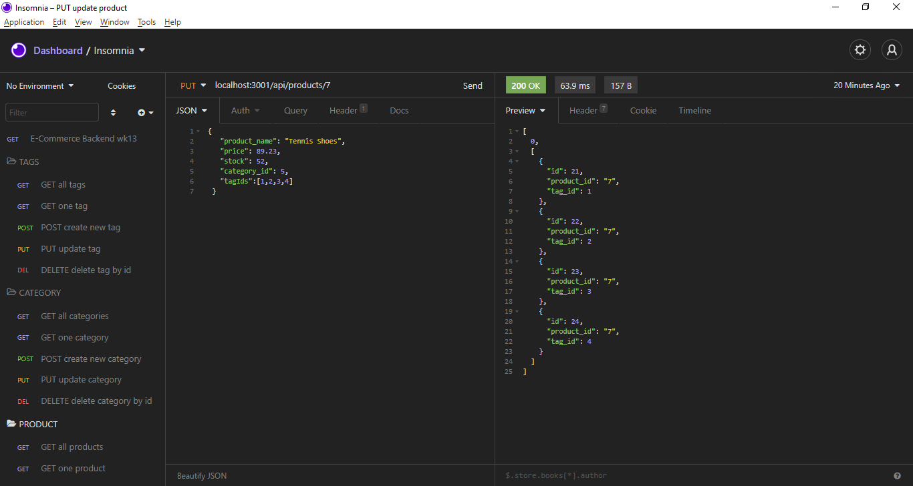
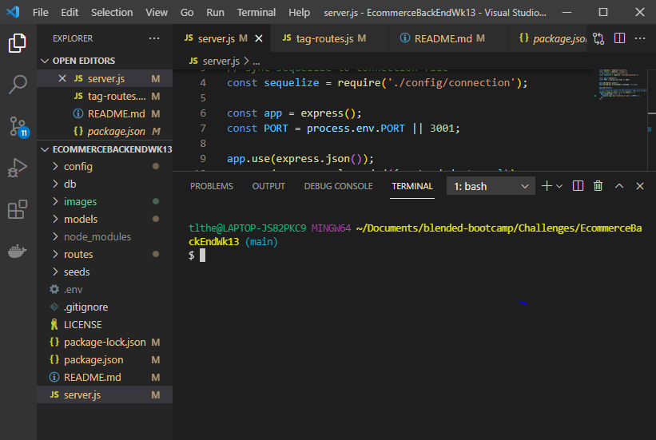

# EcommerceBackEndWk13
  

## Description
Improve a back-end application set with a database and all the create, read, update and delete (CRUD) routes. Then demo the testing of the routes using Insomnia tools and screens. Dynamically create tables in a database and run data to the tables then use the routes to perform the CRUD operations.

## Contents
* [Installation](#installation)
* [Usage](#usage)
   * [Screenshots](#screenshots)
* [Contributing](#contributing)
* [Credits](#credits)
* [Tests](#tests)
* [Questions](#questions)
* [License](#license)

## Installation
This application needs to install: 
To get started clone this repository using

git clone git@github.com:ttheis1611/EcommerceBackEndWk13.git
Both Node.js and MySQL must be installed on your computer. Demo at https://drive.google.com/file/d/1JlaBl-yXjy7S6iMk5zFGAXVXSF2WiDRf/view

Install dependencies

npm init --y
npm install express sequelize mysql2 dotenv
Open up MySQL shell and input

source db/schema.sql
and

use ecommerce_db
Then quit MySQL shell and input the following in your terminal

npm run seed
to start running application simply input

node server.js
Open up Insomnia core to GET, POST, PUT and DELETE from different routes.
  
## Usage
Npm [Dotenv, Sequelize, Express, MySql]
  
### Screenshots

 

 

### Demo Link
[Demo](https://drive.google.com/file/d/1JlaBl-yXjy7S6iMk5zFGAXVXSF2WiDRf/view)

## Contributing
Be kind to each other and share knowledge.
  
## Credits
* [Kelly Gowing]
* [Benn Asabir]
* [Elliot Payne]

  
## Questions
Created by ttheis1611. 
      If you have any questions about this repo, please contact me at tltheis@prodigy.net.
  
## License
This application is covered under MIT.
